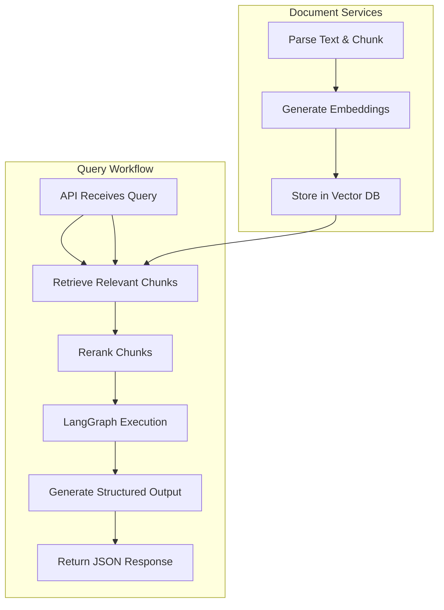

# Recurrent Language Model with LangGraph
API Services & Core Language Modeling Pipeline

---

## Overview

This project provides a modular API interface for interacting with a Recurrent Language Model (RLM) powered by LangGraph, combining stateful sequential modeling with graph-based workflow orchestration.

The system allows:

- Text input ingestion and preprocessing
- Model inference using a recurrent architecture
- Structured response delivery via REST API
- Integration with vector stores and embedding pipelines

It is designed as a robust backend for AI-driven applications, supporting scalable, context-aware, and multi-step text generation pipelines.

---

## What is a Recurrent Language Model (RLM)?

A Recurrent Language Model (RLM) is a neural network that processes sequences of tokens one at a time, maintaining an internal hidden state that captures prior context. Unlike feedforward models, RLMs are capable of remembering information from previous steps, enabling coherent, context-aware text generation.

Key features:

- Sequential Processing: Updates hidden states at each token, maintaining context
- Context Awareness: Predicts next tokens based on the full prior sequence
- Generative Capabilities: Produces text continuations, summaries, or multi-turn dialogue
- Applications: Chatbots, summarization, question answering, AI assistants, code generation

In this project, the RLM is orchestrated using LangGraph, allowing developers to define workflow graphs connecting preprocessing, embedding, retrieval, inference, and output formatting nodes.

---

## Key Components

1. Text Input Ingestion & Preprocessing
   - Accepts single or batch text prompts
   - Cleans input, removes unwanted characters, and tokenizes text
   - Optionally uses metadata for context-aware generation

2. API-Based Model Inference
   - Connects to LangGraph RLM for sequential generation
   - Configurable parameters: max_tokens, temperature, top-k, top-p
   - Supports multi-turn reasoning, chained tasks, and sequential query handling

3. Structured Response Generation
   - Converts raw model output into structured JSON
   - Includes metadata: request ID, timestamps, inference parameters
   - Outputs ready for downstream API consumers

4. Modular Architecture
   - Clear separation of API, model, and workflow logic
   - Extensible pipelines for new endpoints, models, or workflows
   - Reusable components across different NLP or AI tasks

---

## Design Priorities

- Clean API structure: Easy to maintain, test, and extend
- Scalable endpoints: Handle concurrent requests efficiently
- Modular architecture: Add new LangGraph workflows without rewriting code
- Future-ready: Compatible with RAG pipelines, vector databases, and AI-driven applications
- Developer-friendly: Detailed logging, error handling, and structured JSON responses

---

## System Capabilities

### API Request Handling

- Accepts structured text input via REST endpoints
- Validates requests with Pydantic schemas
- Supports single or batch prompts
- Optional metadata fields for context-aware generation
- Handles errors gracefully with standardized responses

### Model Inference

- Integrates with LangGraph RLM
- Generates structured outputs from sequential inputs
- Configurable inference parameters:
  - temperature – randomness in generation
  - max_tokens – length of output
  - top-k / top-p – sampling strategy for token selection
- Supports:
  - Sequential text generation
  - Multi-turn conversation
  - Chained reasoning tasks

### Response Structuring

- Converts raw model output into structured JSON
- Includes metadata:
  - Request timestamp
  - Request ID
  - Inference parameters
- Prepares output for downstream pipeline consumption

---

## API Pipeline Structure

The system uses a modular pipeline design with clear separation of responsibilities:

1. Input Handling Layer – Validation, cleaning, tokenization
2. Processing Layer – Embedding, RLM inference, optional retrieval
3. Output Layer – Converts model outputs to structured JSON with metadata

---

## High-Level Workflow


# Recurrent Language Model with LangGraph
API Services & Core Language Modeling Pipeline

---

## Workflow Steps

1. **Parse & Chunk** – Break input text into meaningful chunks  
2. **Embed & Store** – Convert chunks into embeddings in a vector database  
3. **Retrieve Chunks** – Fetch relevant data based on query  
4. **Rerank** – Sort retrieved results by relevance  
5. **LangGraph Execution** – Orchestrate model inference and downstream logic  
6. **Structured Output** – Format output with metadata for API consumers  

---

## LangGraph Integration

LangGraph is a workflow orchestration framework for large language models. It enables:

- **Graph-based node execution** – Each node handles a step: parsing, embedding, inference, etc.  
- **Stateful context flow** – Hidden states and outputs flow between nodes  
- **Conditional and looping edges** – Enables complex workflows like RAG or multi-step reasoning  
- **Reusable pipelines** – Easily extendable for additional models or AI tasks  

By combining RLM with LangGraph, this system supports **context-aware sequential generation**, **multi-turn queries**, and **structured responses**.

---

## Module-Level Breakdown

### `app/core`
- Core RLM integration and inference logic  
- Classes for sequential generation, multi-turn memory, and inference parameters  

### `app/graph`
- LangGraph workflow definitions  
- Nodes, edges, and state flow between preprocessing, embedding, and inference  

### `app/pipelines`
- Modular pipelines for text ingestion, embedding, retrieval, and output generation  
- Reusable components for API endpoints  

### `app/schemas`
- Pydantic schemas for request validation and response structuring  
- Ensures consistent API payloads  

### `app/services`
- Helper functions for vector store interactions, embeddings, and retrieval  

### `app/main.py`
- FastAPI entrypoint  
- Initializes endpoints, pipelines, and LangGraph execution environment  

---

## Technology Stack

| Component           | Technology                     |
|--------------------|--------------------------------|
| Language            | Python                         |
| API Framework       | FastAPI                        |
| Model Integration   | LangGraph RLM                  |
| Validation          | Pydantic / Pydantic-Settings  |
| Server              | Uvicorn                        |
| Data Formats        | JSON                           |
| Architecture Style  | Modular API Pipeline           |
| Vector Stores       | FAISS / Chroma / Pinecone (optional) |

---

## Intended Use Cases

- API-based text generation and NLP  
- Backend service for RAG and AI workflows  
- Structured response generation for downstream AI applications  
- Foundation for experimentation with graph-based sequential language models  

---

## Example Response

```json
{
  "request_id": "12345",
  "timestamp": "2026-03-08T23:50:00Z",
  "output": "A Recurrent Language Model processes text sequentially, maintaining context from previous tokens...",
  "inference_params": {
    "max_tokens": 150,
    "temperature": 0.7
  }
}


## Advanced Use Cases

- **RAG Workflows** – Combine RLM generation with retrieval-augmented knowledge  
- **Multi-turn Dialogue Systems** – Maintain conversational state across API calls  
- **Structured Document Processing** – Parse large documents and generate summaries with metadata  
- **Pipeline Experimentation** – Swap in new models, embeddings, or workflow nodes easily  

## License

This project is licensed under the MIT License.

