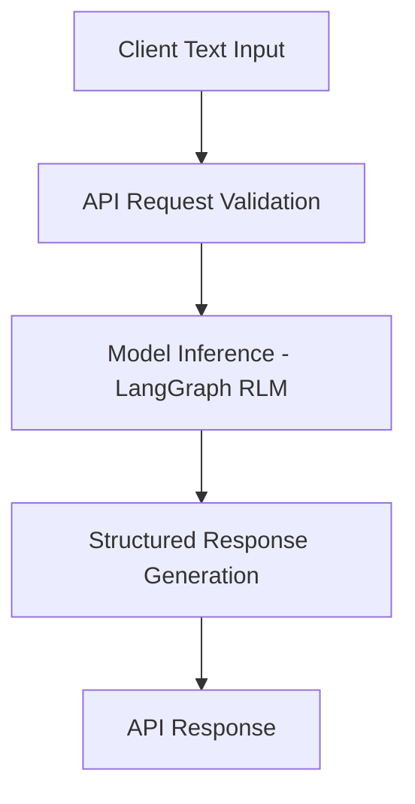

# Recurrent Language Model with LangGraph
API Services & Core Language Modeling Pipeline

## Overview

This project provides a *modular API interface* for interacting with a recurrent language model powered by LangGraph. The system allows text input, model inference, and structured response delivery, serving as a foundation for AI-driven language applications.

It enables easy integration with downstream AI workflows, vector stores, and embedding-based pipelines, providing a robust backend for text generation and processing.

---

## Core Idea

The system handles text inputs, performs model inference using LangGraph, and returns structured outputs via API endpoints.

### Key Components

- Text input ingestion and preprocessing  
- API-based model inference  
- Structured response generation  
- Modular and extendable architecture  

### Design Priorities

- Clean and maintainable API structure  
- Scalable endpoints for multiple requests  
- Modular architecture for adding new models or endpoints  
- Compatibility with future AI-driven pipelines  

---

## System Capabilities

### API Request Handling

- Accepts structured text input via REST endpoints  
- Validates incoming requests using Pydantic schemas  
- Handles error responses gracefully  

Users can interact with:

- Single text prompts  
- Batch text inputs  
- Optional metadata for context-aware generation  

---

### Model Inference

- Connects to the LangGraph recurrent language model  
- Generates structured textual outputs  
- Supports configurable inference parameters  

Capabilities include:

- Sequential text generation  
- Context-aware outputs  
- Model serving for downstream applications  

---

### Response Structuring

- Converts raw model output into structured JSON  
- Includes metadata such as timestamps, request ID, and inference info  
- Prepares output for downstream API consumers  

---

### API Pipeline Structure

The system uses a modular pipeline design:

- Clear separation between input handling, model inference, and output formatting  
- Reusable endpoint components  
- Easy integration with additional AI models or LangChain workflows  

---

## High-Level Architecture

## Core Layers

- **Request Layer** – Handles incoming API calls and validates payloads  
- **Processing Layer** – Text preprocessing and model inference  
- **Response Layer** – Structuring outputs for client consumption  

---

## Design Principles

- API-first architecture  
- Modular endpoint design  
- Clean separation between model and interface  
- Scalable for multiple concurrent requests  
- Ready for integration with RAG pipelines and vector stores  

---

## Workflow Summary

- Client sends text input via API endpoint  
- Request payload is validated and preprocessed  
- Text is passed to LangGraph RLM for inference  
- Model output is structured into JSON response  
- API returns structured result to the client  

---

## Technology Stack

| Component | Technology |
|-----------|------------|
| Language | Python |
| API Framework | FastAPI |
| Model Integration | LangGraph RLM |
| Validation | Pydantic / Pydantic-Settings |
| Server | Uvicorn |
| Data Formats | JSON |
| Architecture Style | Modular API Pipeline |

---

## Intended Use Cases

- API-based text generation and language modeling  
- Backend service for RAG and AI workflows  
- Structured response generation for downstream AI applications  
- Foundation for language model experimentation and integration  

---

## License

This project is licensed under the MIT License.
