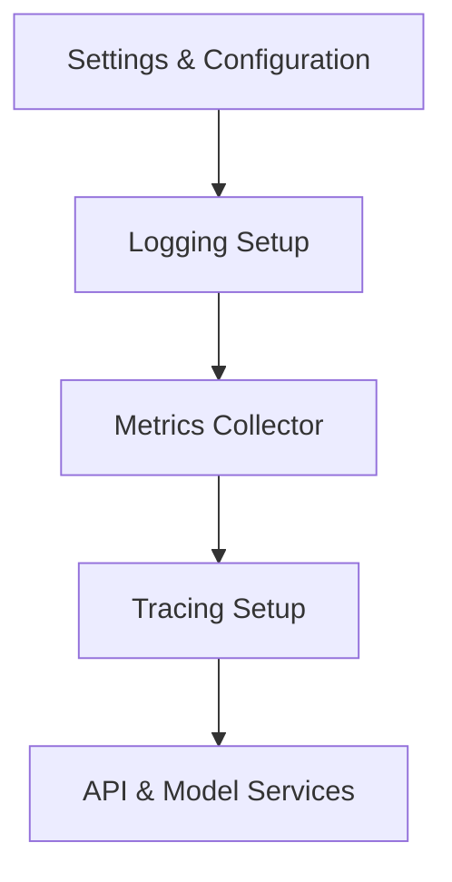

# Core Modules – Recurrent Language Model with LangGraph
Shared utilities and foundational modules for the API and model services.

## Overview

The `app/core` directory contains core modules that provide *shared utilities, configuration, logging, metrics, and tracing* across the RLM system.  
These modules ensure consistent behavior, observability, and maintainability across the API and backend services.

---

## Core Idea

These modules centralize all core functionality required for the application to operate reliably. They provide:

- Unified configuration management  
- Centralized logging  
- Metrics collection and reporting  
- Optional tracing for observability  

This allows the rest of the system to focus on **model inference and API functionality** without duplicating boilerplate.

---

## Modules and Capabilities

### Configuration (`config.py`)

- Manages application settings using Pydantic-Settings  
- Reads environment variables and `.env` files  
- Caches settings for efficient reuse  
- Configurable parameters include API keys, model names, vector database info, and operational limits  

**Key Features:**

- Centralized settings for API, embeddings, LangGraph, and Qdrant  
- Easy adjustment of runtime parameters without code changes  
- Supports sandbox mode, vector fallback, chunking, and tracing flags  

---

### Logging (`logging.py`)

- Provides unified logging setup across the application  
- Configurable log levels and structured output  
- Logs messages to stdout for containerized deployment  

**Key Features:**

- Standardized log formatting  
- Central logger for model, API, and metrics components  
- Supports dynamic log levels via environment variables  

---

### Metrics (`metrics.py`)

- Tracks performance and usage metrics for queries  
- Monitors latencies, document retrieval, reranking, and tool usage  
- In-memory storage with summary reporting  

**Key Features:**

- `QueryMetrics` records per-query statistics  
- `MetricsCollector` aggregates and logs metrics  
- Provides actionable insights into API and model performance  

---

### Tracing (`tracing.py`)

- Enables optional LangSmith tracing for observability  
- Configures environment variables for LangChain tracing  
- Controlled via configuration flags  

**Key Features:**

- Simple on/off tracing via settings  
- Supports project-specific API keys  
- Integrates seamlessly with existing LangChain workflows  

---

## High-Level Architecture

## Core Layers

- **Configuration Layer** – Centralized app and model settings  
- **Logging Layer** – Unified logging for observability  
- **Metrics Layer** – Captures performance and usage data  
- **Tracing Layer** – Optional distributed tracing for RAG and AI pipelines  

---

## Design Principles

- Centralized core utilities for consistency  
- Modular design for reuse across API and model services  
- Observability-first: logging, metrics, and tracing  
- Configurable and environment-aware  
- Easy integration with other LangGraph or AI modules  

---

## Workflow Summary

- Core modules are loaded at application startup  
- Configuration is cached for use by all services  
- Logging is initialized before model or API calls  
- Metrics and tracing are optionally enabled for each query  
- API and model components use these utilities for stable operation  

---

## Technology Stack

| Component | Technology |
|-----------|------------|
| Language | Python |
| Configuration | Pydantic / Pydantic-Settings |
| Logging | Python logging module |
| Metrics | Python dataclasses + in-memory storage |
| Tracing | LangSmith / LangChain environment integration |

---

## Intended Use Cases

- Centralized configuration for API and model services  
- Unified logging for debugging and observability  
- Metrics collection for performance monitoring  
- Optional tracing for distributed workflows  
- Reusable foundation for AI, RAG, and LangGraph pipelines  

---

## License

This project is licensed under the MIT License.
