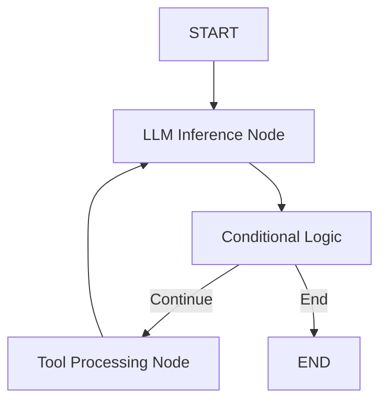

# Graph Module – Recurrent Language Model with LangGraph

Graph definitions and orchestration logic for the LangGraph based recurrent language model.

## Overview

The `app/graph` directory contains the *graph construction and execution logic* used to build, manage, and run the LangGraph workflows for your language model.

This module defines how the system orchestrates multiple nodes, handles state transitions, integrates with the LLM model, and optionally persists graph state. LangGraph provides a graph‑based framework for building long‑running, stateful workflows that go beyond simple sequential pipelines — enabling loops, branching, persistence, and conditional logic.:contentReference[oaicite:0]{index=0}

---

## Core Idea

Your graph module’s purpose is to *model the recurrent logic flow* of the language system using LangGraph primitives.

### Key Components

- **State Definition** – The data structure that represents shared graph state  
- **Node Functions** – Functions representing individual units of processing tasks  
- **Edges** – Directed connections between nodes defining workflow paths  
- **Graph Compilation** – Assembly of all nodes and edges into a runnable compiled graph  
- **Execution** – Method to invoke the graph with input data and retrieve a structured output

---

## System Capabilities

### Graph Construction

- Define the **state schema** for the workflow (e.g., message state, tokens, metadata)
- Add processing **nodes** that represent model calls, tool invocation, or state updates
- Add **edges** which determine how the graph progresses from one node to another
- Add **conditional edges** for branching logic based on state content

This allows the graph to model loops, decisions, and repeated inference steps — essential for a recurrent reasoning pipeline.:contentReference[oaicite:1]{index=1}

---

### Graph Compilation

Once nodes and edges are defined, the graph is **compiled** into a runnable object that supports:

- `.invoke()` – Run the graph end‑to‑end with synchronous input  
- `.astream()` / `.ainvoke()` – Async execution and streaming outputs  
- Optional hook points for external observers or logs

Compilation ensures efficient, validated execution structure for the defined workflow.:contentReference[oaicite:2]{index=2}

---

### Execution Flow

A typical graph execution:

1. Input is added to the initial state
2. Entry node begins processing (often the model node)
3. Nodes evaluate and update state
4. Conditional logic decides next node
5. Graph progresses until completion

This supports complex language reasoning requiring loops and stateful steps.:contentReference[oaicite:3]{index=3}

---

## High‑Level Architecture

## Design Principles

- **Explicit control flow** – Graph reflects exactly how reasoning steps connect  
- **Stateful logic** – Nodes share and update a structured state object  
- **Modular nodes** – Easy to add or remove new processing steps  
- **Recurrent workflows** – Supports loops for repeated reasoning or tool calls  
- **Conditional transitions** – Branch on graph state to dynamically change logic paths  

---

## Workflow Summary

- Graph is defined with state and nodes  
- Edges and conditional edges are added  
- Graph is compiled into a runnable object  
- The API passes input into the graph invocation  
- Graph executes and returns structured results  

---

## Technology Stack

| Component | Technology |
|-----------|------------|
| Language | Python |
| Graph Library | LangGraph (Python) |
| State Modeling | TypedDict / Pydantic |
| Execution | Compiled LangGraph Workflow |
| Integration | FastAPI / Model Inference |

---

## Intended Use Cases

- Sequence control for LLM reasoning workflows  
- Multistep model pipelines with conditional logic  
- Stateful AI agent orchestration  
- RAG workflows needing dynamic tool invocation  
- Debuggable and persistent language graph execution  

---

## License

This module is part of the Recurrent Language Model with LangGraph project, licensed under the MIT License.
