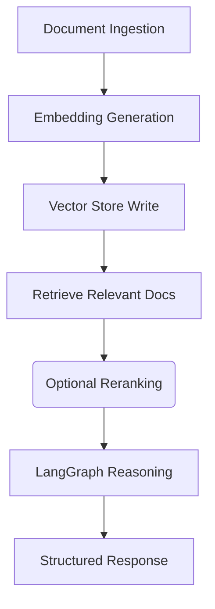

# Pipelines Module – Recurrent Language Model with LangGraph

Reusable and structured processing pipelines for document ingestion, vector storage, retrieval, and LLM‑based reasoning workflows.

## Overview

The `app/pipelines` directory contains the *pipeline implementations* that orchestrate flows such as:

- Document ingestion and chunking  
- Embeddings generation  
- Vector storage and retrieval  
- RAG (Retrieval‑Augmented Generation) workflows  
- Graph‑based recurrent language model execution

These pipelines combine core building blocks like embeddings, databases, and language models into *high‑level workflows* that can be reused across API endpoints and background jobs.

---

## Core Idea

Pipelines define *end‑to‑end data flows* that connect:

1. Document ingestion and preprocessing  
2. Embedding generation  
3. Vector store reading/writing  
4. Relevant document retrieval  
5. Model invocation via LangGraph

This modular pipeline design makes workflows easier to reuse, debug, and expand.

---

## System Capabilities

### Document Ingestion & Chunking

- Load and process uploaded files  
- Chunk text into manageable pieces  
- Store metadata alongside text  
- Prepare documents for embedding

---

### Embedding Generation

- Convert text chunks into vector embeddings  
- Use the configured embedding model  
- Supports batching and parallel encoding

---

### Vector Storage & Retrieval

- Store text chunks and embeddings in a vector database  
- Efficient nearest‑neighbor search  
- Retrieve top relevant chunks for a query

---

### Relevance Filtering & Reranking

- Filter retrieved chunks  
- (Optional) Rerank using similarity or model signals  
- Pass filtered chunks to the reasoning stage

---

### Model Invocation

- Feed retrieved context into the LangGraph workflow  
- Support conditional steps based on model output  
- Return final structured results

---

## High‑Level Architecture

## Design Principles

- Modular pipeline components  
- Clear separation of concerns  
- Reusable across API handlers and background workflows  
- Easy to extend with custom steps  
- Supports batching and parallel processing  

---

## Workflow Summary

- Documents are ingested and split into chunks  
- Embeddings are generated and stored in a vector database  
- For each query, similar chunks are retrieved  
- Retrieved chunks are optionally reranked  
- Context and query are fed to the reasoning graph/model  
- Pipeline returns a structured response  

---

## Technology Stack

| Component | Technology |
|-----------|------------|
| Language | Python |
| Embeddings | Sentence‑Transformers |
| Vector Store | Qdrant |
| Document Parsing | PyMuPDF / text extractors |
| Pipelines | Python functions and reusable modules |
| Model Integration | LangGraph / LangChain |

---

## Intended Use Cases

- Bulk document indexing for semantic search  
- RAG workflows combining embedding retrieval and LLM reasoning  
- Custom preprocessing and filtering pipelines  
- Reusable building blocks for multiple API endpoints  
- Foundation for AI search‑assisted applications  

---

## License

This module is part of the Recurrent Language Model with LangGraph project, licensed under the MIT License.
