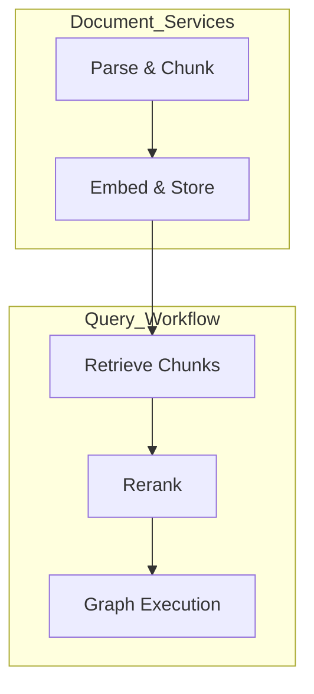

# Services Module – Recurrent Language Model with LangGraph

Shared service utilities that encapsulate core backend functionality and orchestrate reusable operations across the API, pipelines, and graph workflows.

## Overview

The `app/services` directory contains modules that provide core business logic and utilities that aren’t specific to a single endpoint or pipeline. These service functions support:

- Document ingestion and storage  
- Embedding generation and vector store interaction  
- Document retrieval and relevance processing  
- Graph execution orchestration  
- Miscellaneous helpers for internal operations  

This module organizes common workflows into reusable services, reducing duplication and improving maintainability across the codebase.

---

## Core Idea

Services expose reusable functions that encapsulate complex backend logic. Rather than placing implementation details inside endpoints or pipelines, they are abstracted here for:

- Cleaner API handlers  
- Testable business logic  
- Orchestrated workflows across modules  
- Easy expansion or replacement of components  

---

## System Capabilities

### Document Processing

- Accept raw documents and files  
- Parse and chunk text  
- Store document chunks with metadata  
- Integrate with vector store write operations  

---

### Embeddings and Storage

- Generate embeddings for text chunks  
- Write vectors into the configured vector store (e.g., Qdrant)  
- Handle batching and efficient indexing  

---

### Retrieval and Ranking

- Retrieve nearby/related chunks for a query  
- Optionally rerank based on similarity or model signals  
- Prepare context bundles for model execution  

---

### Graph Execution

- Orchestrate graph invocation for recurrent workflows  
- Pass state and inputs into LangGraph workflows  
- Fetch and return structured results  

---

## High‑Level Architecture

## Design Principles

- **Reusable logic** – Avoid duplication across endpoints  
- **Separation of concerns** – Services focus on business workflows  
- **Composable functions** – Easy to combine into larger pipelines  
- **Testable and maintainable** – Clear boundaries for logic  

---

## Workflow Summary

- Documents are processed into chunks via service functions  
- Embeddings are generated and stored by vector store services  
- Queries use retrieval services to find relevant context  
- Retrieved context feeds into execution services  
- Services return results in consistent formats  

---

## Technology Stack

| Component | Technology |
|-----------|------------|
| Language | Python |
| Vector Store | Qdrant |
| Embeddings | Sentence‑Transformers |
| Document Parsing | PyMuPDF / text extractors |
| Model Execution | LangGraph / LangChain |
| Service Layer | Custom Python modules |

---

## Intended Use Cases

- Backend orchestration for document pipelines  
- Model inference and graph‑based reasoning workflows  
- Shared utilities for API endpoints  
- Wrapping business logic for modular reuse  

---

## License

This module is part of the Recurrent Language Model with LangGraph project, licensed under the MIT License.
